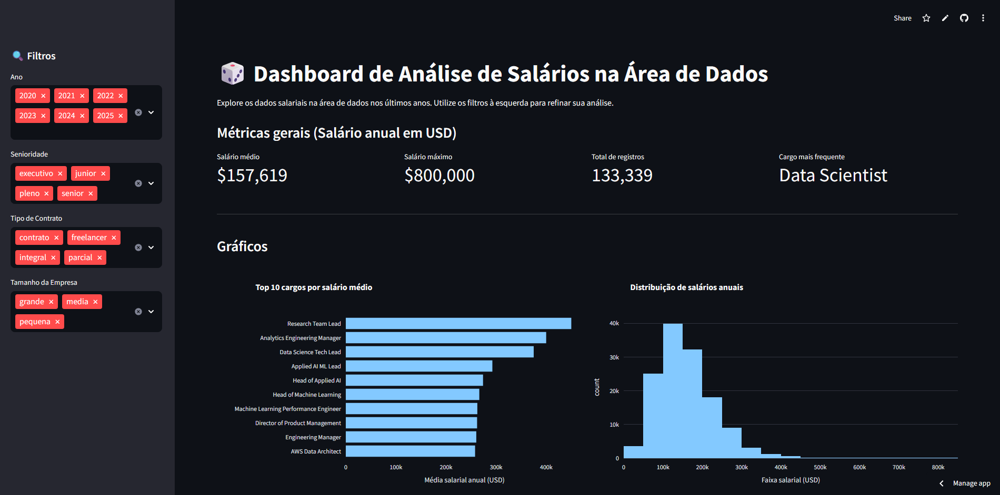
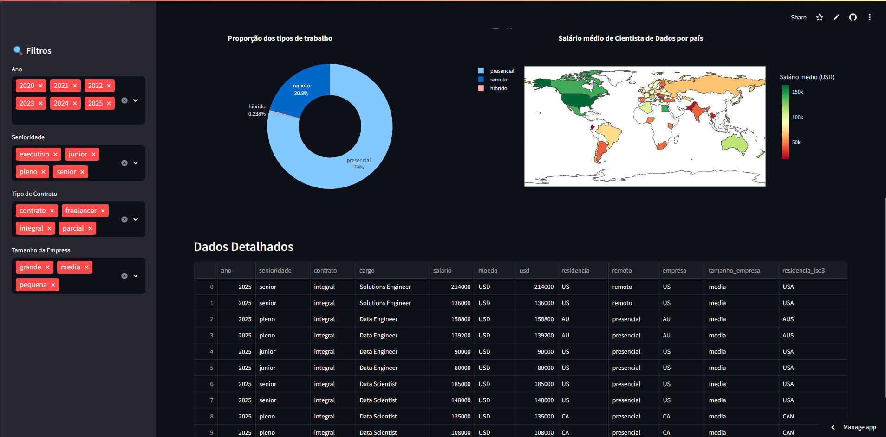

# 📊 Dashboard de Análise Salarial na Área de Dados

Este projeto foi desenvolvido durante a Imersão de Dados da Alura, com foco em análise salarial na área de tecnologia e dados. Utilizamos Python e bibliotecas poderosas como Pandas, Seaborn e Plotly para explorar os dados, e Streamlit para criar um dashboard interativo e acessível via web.

## 🔧 Tecnologias Utilizadas

- Python
- Pandas
- Seaborn
- Plotly
- Streamlit

## 📁 Estrutura do Projeto

- `notebooks/`: Análise exploratória e construção dos gráficos no Google Colab
- `dashboard/`: Código do app em Streamlit
- `data/`: Base de dados utilizada
- `requirements.txt`: Dependências do projeto

## 📈 Funcionalidades do Dashboard

- Filtros interativos:
  - Ano (2020–2025)
  - Senioridade (executivo, junior, pleno, senior)
  - Tipo de contrato (contrato, freelancer, integral, parcial)
  - Tamanho da empresa (grande, média, pequena)

- Métricas gerais:
  - Salário médio: **$157,619**
  - Salário máximo: **$800,000**
  - Total de registros: **133,339**
  - Cargo mais frequente: **Data Scientist**

- Visualizações:
  - 📌 Top 10 cargos por salário médio
  - 📊 Distribuição de salários anuais
  - 🧭 Proporção dos tipos de trabalho (presencial, remoto, híbrido)
  - 🌍 Salário médio de Cientista de Dados por país (mapa interativo)
  - 📋 Tabela com dados detalhados filtráveis

## 🚀 Acesso ao Dashboard

- [🔗 Projeto no GitHub](https://github.com/hendersondias/Dashboard-Imersao-de-Dados-Alura)
- [🌐 Dashboard Online via Streamlit](https://dashboard-python-analyser.streamlit.app/)

## 📌 Objetivo

Demonstrar como é possível transformar dados brutos em insights valiosos sobre o mercado de trabalho na área de dados, utilizando ferramentas acessíveis e código aberto.

## 📷 Exemplos de Visualizações

---
